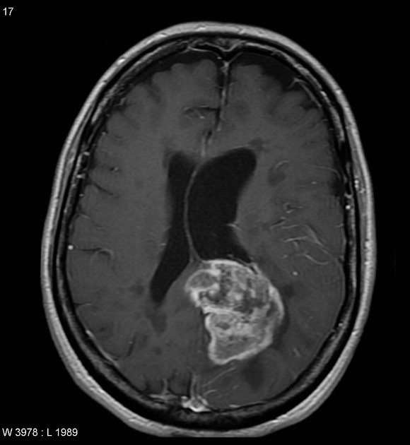
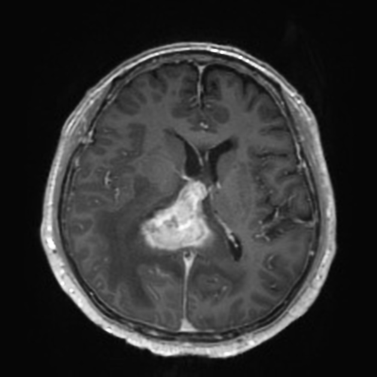

# GBM vs PCNSL

Classify between glioblastoma (GBM) and primary central nervous system lymphoma (PCNSL) in contrast-enhanced T1-weighted MRI.

Glioblastoma       |  Primary central nervous system lymphoma
:-----------------:|:----------------------------------------:
  |  
Case courtesy of Assoc Prof Frank Gaillard, <a href="https://radiopaedia.org/">Radiopaedia.org</a>. From the case <a href="https://radiopaedia.org/cases/5565">rID: 5565</a>. | Case courtesy of Dr Bruno Di Muzio, <a href="https://radiopaedia.org/">Radiopaedia.org</a>. From the case <a href="https://radiopaedia.org/cases/64657">rID: 64657</a>.


```
$ python predict.py savedmodels/augment images/sample-*.jpeg
images/sample-gbm.jpeg                   100.00 % GBM
images/sample-pcnsl.jpeg                 100.00 % PCNSL
```

_Note: the saved models are not part of this repository. Please contact the authors for access to the models._


# Method

1. Data were originally in PNG format.
2. PNGs were processed and saved to HDF5 using the Jupyter Noteook `convert_images_to_hdf5.py`.
3. [EfficientNetB4](https://arxiv.org/abs/1905.11946) (published in ICML 2019) architecture was used to classify between GBM and PCNSL.
    - Model implemented in `keras_applications` and accessed with tensorflow.
    - Model was trained using the script `train_efficientnetb4.py`.
4. Checkpoints were converted to TensorFlow's SavedModel format using `convert_ckpt_to_savedmodel.py`.
5. Predictions and calculation of metrics like ROC AUC done in `predict.ipynb`.
    - This was done on a blinded dataset (i.e., the person running the prediction did not have access to the reference labels).


# Requirements

- `h5py`
- `matplotlib` (for plotting metrics like ROC curve)
- `numpy`
- `scikit-learn` (for calculating metrics on predicted values)
- `tensorflow>=2.0.0`
